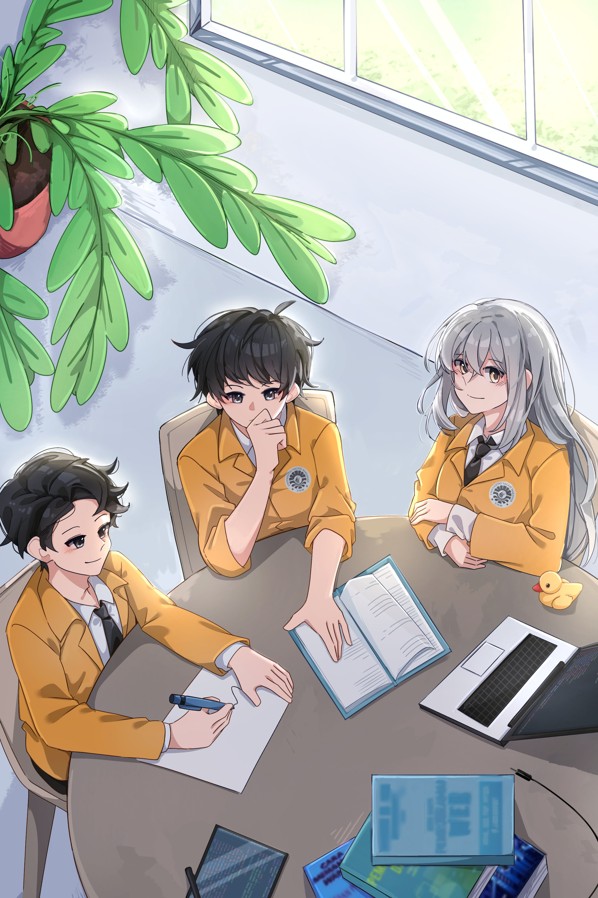

<!-- ═══════════════════════════════════════════════ HEADER ══ -->
<div align="center">
  
</div>

<!-- ═══════════════════════════════════════════ TYPING ══ -->
<div align="center">
  
</div>

<br/>

<!-- ═══════════════════════════════════════ SOCIAL LINKS ══ -->
<div align="center">
  <a href="https://www.youtube.com/@MuhammadAkramMarzuki">
    
  </a>&nbsp;
  <a href="https://www.instagram.com/mhmdakramm.png/">
    
  </a>&nbsp;
  <a href="https://www.threads.com/@mhmdakramm.png">
    
  </a>&nbsp;
  
</div>

<br/>

<!-- ═══════════════════════════════════════ SPLIT LAYOUT ══ -->
<table width="100%" align="center">
<tr>
<td width="50%" valign="middle">

```bash
╭─ mhmdaqramm@github ~
╰─$ cat profile.yaml
```
```yaml
name     : Muhammad Akram Marzuki
alias    : mhmdaqramm
from     : Bantaeng, South Sulawesi 🇮🇩
uni      : Universitas Negeri Makassar
faculty  : Fakultas Teknik
major    : Computer Engineering
batch    : 2025 — TEKOM-B
org      : Google Developer on Campus
hobbies  :
  - Coding 💻
  - Illustration 🎨
  - Watching Anime 🍥
timezone : Asia/Makassar (UTC+08:00)
status   : "Still figuring it all out... 🌱"
```

</td>
<td width="4%"></td>
<td width="46%" valign="middle" align="center">


<sub><i>✏️ Original illustration — "In Cafe, UNM"</i></sub>

</td>
</tr>
</table>

<!-- ═══════════════════════════════════ AFFILIATIONS ══ -->
<h2>🏛️ Affiliations</h2>

<div align="center">
<table>
  <tr>
    <td align="center" width="160">
      <br/>
      <sub><b>Kab. Bantaeng</b><br/><i>South Sulawesi, ID</i></sub>
    </td>
    <td align="center" width="160">
      <br/>
      <sub><b>Fakultas Teknik</b><br/><i>Universitas Negeri Makassar</i></sub>
    </td>
    <td align="center" width="160">
      <br/>
      <sub><b>Computer Engineering</b><br/><i>Informatics & ICT Dept.</i></sub>
    </td>
    <td align="center" width="160">
      <br/>
      <sub><b>TEKOM-B 2025</b><br/><i>My class batch</i></sub>
    </td>
  </tr>
</table>
</div>

<br/>

<!-- ═══════════════════════════════════════ TECH STACK ══ -->
<h2>🛠️ Tech Stack</h2>

<div align="center">

```bash
$ cat skills.txt | grep --include="[learning]"
```

<br/>

<!-- Row 1: Languages -->
<table>
<tr>
  <td align="center">
    <br/>
    <sub><b>C++</b></sub><br/>
    <sub>🟡 Novice</sub>
  </td>
  <td align="center">
    <br/>
    <sub><b>Java</b></sub><br/>
    <sub>🟡 Novice</sub>
  </td>
  <td align="center">
    <br/>
    <sub><b>Python</b></sub><br/>
    <sub>🟡 Novice</sub>
  </td>
  <td align="center">
    <br/>
    <sub><b>Git</b></sub><br/>
    <sub>🔵 Learning</sub>
  </td>
  <td align="center">
    <br/>
    <sub><b>GitHub</b></sub><br/>
    <sub>🔵 Learning</sub>
  </td>
  <td align="center">
    <br/>
    <sub><b>VS Code</b></sub><br/>
    <sub>🟢 Daily</sub>
  </td>
</tr>
</table>

<br/>
<sub><i>⚡ Stack will evolve — I'm just getting started.</i></sub>

</div>

<br/>

<!-- ═════════════════════════════════ GITHUB STATS ══ -->
<h2>📊 GitHub Stats</h2>

<div align="center">


&nbsp;


</div>

<div align="center">
  
</div>

<br/>

<!-- Activity Graph -->
<div align="center">
  
</div>

<br/>

<!-- Trophies -->
<div align="center">
  
</div>

<br/>

<!-- ═══════════════════════════════════ SNAKE ANIMATION ══ -->
<h2>🐍 Contribution Snake</h2>

<div align="center">
  <picture>
    <source media="(prefers-color-scheme: dark)"  srcset="https://raw.githubusercontent.com/mhmdaqramm/mhmdaqramm/output/github-snake-dark.svg"/>
    <source media="(prefers-color-scheme: light)" srcset="https://raw.githubusercontent.com/mhmdaqramm/mhmdaqramm/output/github-snake.svg"/>
    
  </picture>
</div>

<br/>

<!-- ═══════════════════════════════════ CREATIVE WORKS ══ -->
<h2>🎨 Creative Works</h2>

<div align="center">

<sub>Beyond code — I also create. Here's a glimpse of my illustration work.</sub>

<br/><br/>

<table>
  <tr>
    <td align="center">
      <br/>
      <sub>📍 <b>In Cafe — UNM</b><br/>Original digital illustration</sub>
    </td>
    <td align="center">
      <br/>
      <sub>💛 <b>Best Dad Ever</b><br/>Original digital illustration</sub>
    </td>
  </tr>
</table>

<br/>

<a href="https://www.instagram.com/mhmdakramm.png/">
  
</a>
&nbsp;
<a href="https://www.youtube.com/@MuhammadAkramMarzuki">
  
</a>

</div>

<br/>

<!-- ═══════════════════════════════════════ CONNECT ══ -->
<h2>🤝 Let's Connect</h2>

<div align="center">

```bash
$ echo "Open to learn · collaborate · and just say hi 👋"
```

<br/>

<a href="https://www.youtube.com/@MuhammadAkramMarzuki">
  
</a>
&nbsp;
<a href="https://www.instagram.com/mhmdakramm.png/">
  
</a>
&nbsp;
<a href="https://www.threads.com/@mhmdakramm.png">
  
</a>

<br/><br/>
<sub>🏠 Working from home — Bantaeng, South Sulawesi, Indonesia</sub>

</div>

<br/>

<!-- ═══════════════════════════════════════ FOOTER ══ -->
<div align="center">
  
  <sub>Made with ❤️ by <a href="https://github.com/mhmdaqramm">mhmdaqramm</a> · Inspired by the open source community</sub>
</div>
