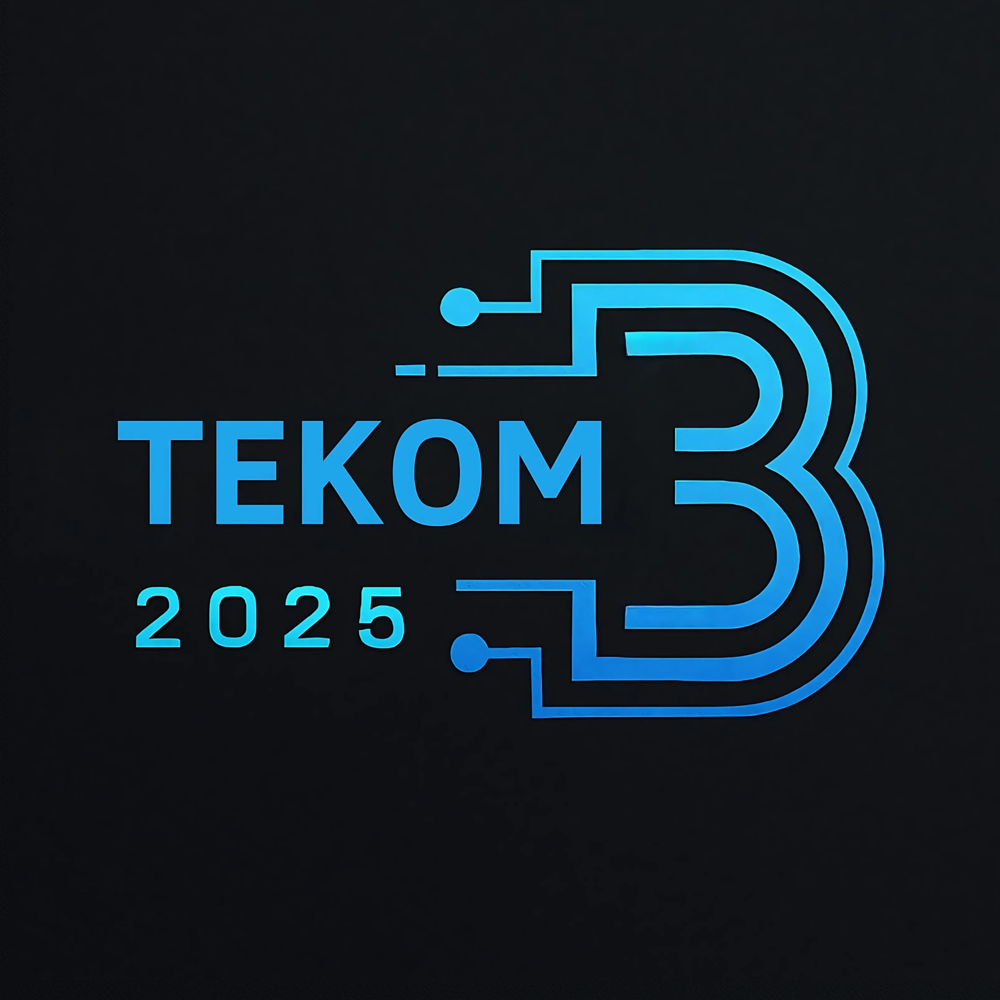
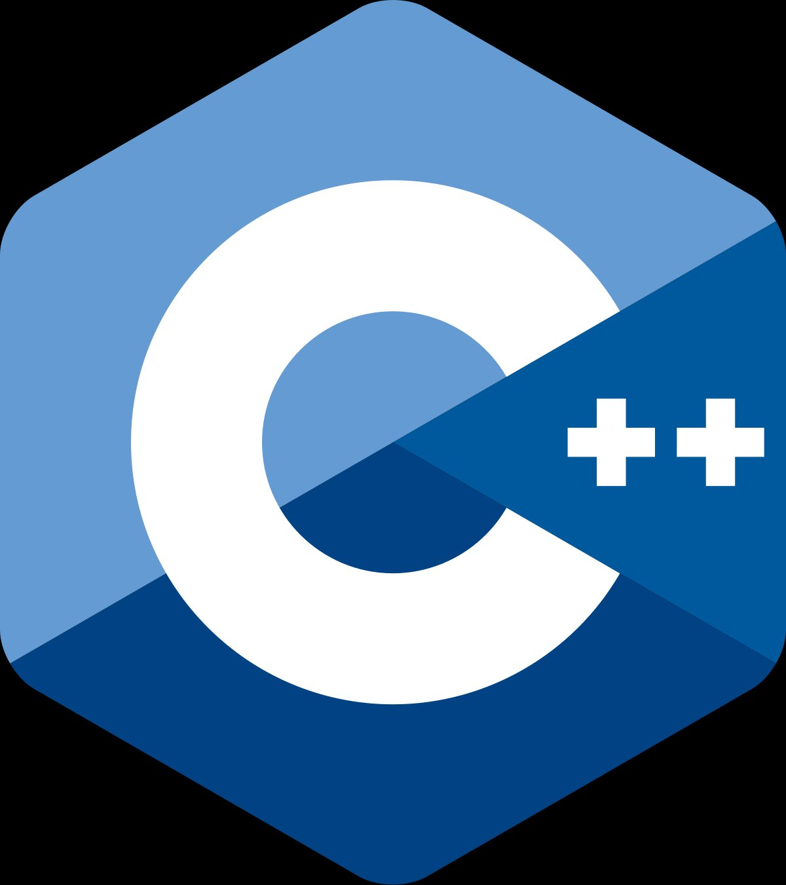
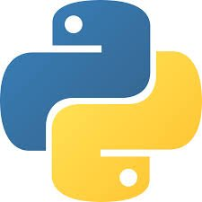
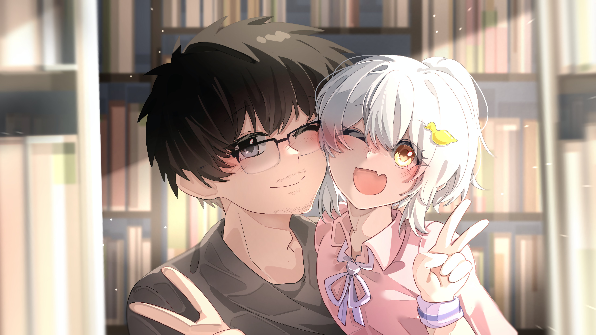

<!-- Header -->
<div align="center">
  
</div>

<!-- Typing SVG -->
<div align="center">
  <a href="https://git.io/typing-svg">
    
  </a>
</div>

<br/>

<!-- Intro Split Layout -->
<table align="center" border="0" cellspacing="0" cellpadding="0">
<tr>
<td width="52%" valign="top">

### 👤 Who am I?

```yaml
 name     : Muhammad Akram Marzuki
 alias    : mhmdaqramm
 origin   : Bantaeng, South Sulawesi 🇮🇩
 uni      : Universitas Negeri Makassar
 faculty  : Fakultas Teknik
 major    : Computer Engineering (JTIK)
 batch    : 2025 — TEKOM-B
 campus   : Google Developer on Campus
 hobbies  : Coding · Illustration · Anime
 timezone : UTC +08:00
```

> *"Every expert was once a beginner."*

</td>
<td width="4%"></td>
<td width="44%" valign="top" align="center">


<sub><i>Original illustration — In Cafe UNM</i></sub>

</td>
</tr>
</table>

---

<!-- Affiliations -->
## 🏛️ Affiliations

<div align="center">

<table>
  <tr>
    <td align="center">
      <br/>
      <sub><b>Kab. Bantaeng</b><br/>South Sulawesi, ID</sub>
    </td>
    <td align="center">
      <br/>
      <sub><b>Fakultas Teknik</b><br/>Universitas Negeri Makassar</sub>
    </td>
    <td align="center">
      <br/>
      <sub><b>Informatics &</b><br/>Computer Engineering</sub>
    </td>
    <td align="center">
      <br/>
      <sub><b>TEKOM-B 2025</b><br/>My Class Batch</sub>
    </td>
  </tr>
</table>

</div>

---

<!-- Tech Stack -->
## 🛠️ Tech Stack

<div align="center">

<sub>Currently learning — building the foundation 🧱</sub>

<br/><br/>

<table>
  <tr>
    <td align="center" width="110">
      <br/>
      <sub><b>C++</b></sub><br/>
      
    </td>
    <td align="center" width="110">
      <br/>
      <sub><b>Java</b></sub><br/>
      
    </td>
    <td align="center" width="110">
      <br/>
      <sub><b>Python</b></sub><br/>
      
    </td>
    <td align="center" width="110">
      <br/>
      <sub><b>Git</b></sub><br/>
      
    </td>
    <td align="center" width="110">
      <br/>
      <sub><b>VS Code</b></sub><br/>
      
    </td>
  </tr>
</table>

<br/>

> ⚡ More technologies incoming as the journey continues...

</div>

---

<!-- GitHub Stats -->
## 📊 GitHub Stats

<div align="center">


&nbsp;


</div>

<div align="center">

[](https://git.io/streak-stats)

</div>

<!-- Activity Graph -->
<div align="center">

[](https://github.com/ashutosh00710/github-readme-activity-graph)

</div>

<!-- Trophies -->
<div align="center">

[](https://github.com/ryo-ma/github-profile-trophy)

</div>

---

<!-- Creative Works -->
## 🎨 Creative Works

<sub align="center">Beyond code — I also create visual works.</sub>

<div align="center">
<br/>

<table>
  <tr>
    <td align="center">
      <br/>
      <sub>📍 <b>In Cafe — UNM</b><br/>Original Illustration</sub>
    </td>
    <td align="center">
      <br/>
      <sub>💛 <b>Best Dad Ever</b><br/>Original Illustration</sub>
    </td>
  </tr>
</table>

<br/>

[](https://www.youtube.com/@MuhammadAkramMarzuki)
[](https://www.instagram.com/mhmdakramm.png/)

</div>

---

<!-- Connect -->
## 🤝 Let's Connect

<div align="center">

<br/>

[](https://www.youtube.com/@MuhammadAkramMarzuki)
[](https://www.instagram.com/mhmdakramm.png/)
[](https://www.threads.com/@mhmdakramm.png)

<br/>

<sub>🏠 Working from home — always open to learning and connecting.</sub>

</div>

---

<!-- Footer -->
<div align="center">
  
  <sub>
    
    &nbsp;·&nbsp;
    Made with ❤️ by <a href="https://github.com/mhmdaqramm">mhmdaqramm</a>
  </sub>
</div>
